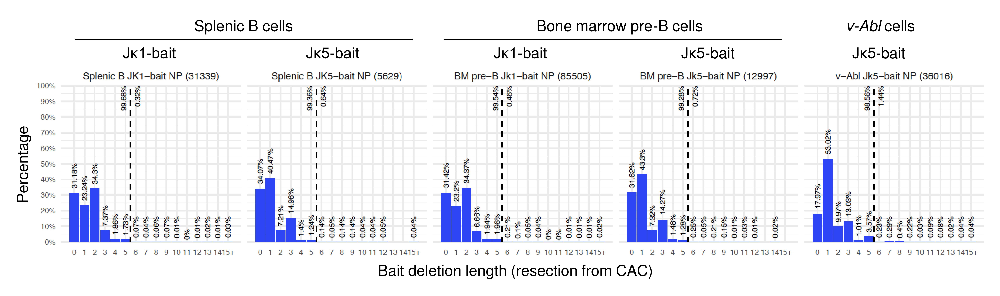
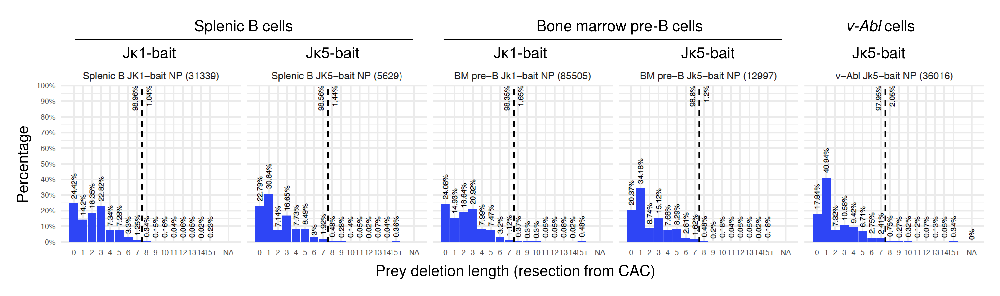
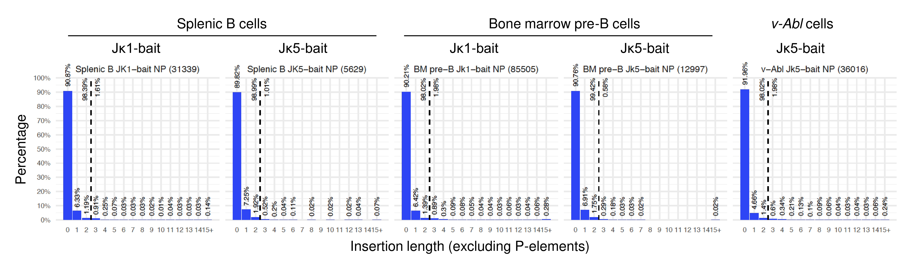

# Igk_specific_anno_and_filter
Scripts related to mouse Igk-specific junctional annotation and filtering pipeline

Author: Adam Yongxin Ye @ Boston Children's Hospital / Harvard Medical School

License: MIT license


## Citation

(in submission, TBD)


## Installation

### Suggested Operation System (OS)

Unlix-like, such as:
- Linux
- MacOS

Users can download and run these perl scripts by `perl xxx.pl` directly in this folder. Or users may move or copy the scripts into any of the folders in their PATH (environmental variable, which can be seen be `echo $PATH`), then the scripts can be directly run by `xxx.pl`.

Typical Installation Time: Downloading the scripts and setting up the environment normally takes less than a few minutes on a standard Linux or MacOS system. No additional dependencies or compilation steps are required.


## Pipeline with Demo

### Step 0. Obtain cryptic RSS junction candidates after filtering out strong RSS sites

Please run the previous strong RSS filtering pipeline [off_targets_RSS_filter](https://github.com/Yyx2626/HTGTS_related/tree/master/off_targets_RSS_filter), to obtain the `.noOnTarget_CACaligned_noGoodRSS.tlx` file as the input of this pipeline.

For demo, I put `demo.noOnTarget_CACaligned_noGoodRSS.tlx` in `demo` folder as a test input tlx file.


### Step 1. Annotate Igk HTGTS-V(D)J-seq junctions, including deletion and insertion lengths

Run `yyx_anno_tlx_midLen_CAC_delLen_insLen.20260129.pl` (see Usage prompts section for details on command-line arguments) to annotate the deletion length from the RSS and the insertion length, as well as P-element length, micro-homology length.

For demo:
```
(date
echo perl yyx_anno_tlx_midLen_CAC_delLen_insLen.20260129.pl demo/demo.noOnTarget_CACaligned_noGoodRSS.tlx ../demo_reference/mm9.fa >demo/demo.anno_delLen_insLen.tlx
time perl yyx_anno_tlx_midLen_CAC_delLen_insLen.20260129.pl demo/demo.noOnTarget_CACaligned_noGoodRSS.tlx ../demo_reference/mm9.fa >demo/demo.anno_delLen_insLen.tlx
date) 2>&1 | tee demo/demo.anno_delLen_insLen.log
```
It may take around one minute to read the reference genome and run through it.

Note 1: Due to file size limit (about 200MB) of github, I removed the genome file `../demo_reference/mm9.fa`. Users may download `mm9.fa.gz` from [UCSC](https://hgdownload.cse.ucsc.edu/goldenpath/mm9/bigZips/), then parse it to only keep the canonical chromosomes by `zless mm9.fa.gz | perl -ne 'BEGIN{ $so=0; } if(/^>/){ $so=0; if(/^>chr[^_]+$/){ $so=1; }} if($so){ print; }' >mm9.fa`, and generate fai index file by `samtools faidx mm9.fa`.

Note 2: User may also specify only one chromosome containing Igk locus (e.g. mm9.chr6.fa) here, then it will annotate "-" (meaning NA) if prey or bait is not on that chromosome, which will then be filtered out by Step 2 if its argument <na_filtered_out> is set to 1.


### Step 2. Filter out junctions with long deletion or insertion lengths (artifacts)

Run `yyx_filter_by_colname_expr.20260124.pl` (see Usage prompts section for details on command-line arguments) to filter out artifacts with long deletion or insertion length (B_delLen > 5, P_delLen > 7 or nonPinsLen > 2, see Justification section).

For demo:
```
(date
echo perl yyx_filter_by_colname_expr.20260124.pl demo/demo.anno_delLen_insLen.tlx demo/demo.maxBdelLen5_maxPdelLen7_maxInsLen2.pass.tlx demo/demo.maxBdelLen5_maxPdelLen7_maxInsLen2.filtered_out.tlx 1 "B_delLen_adj <= 5 && P_delLen_adj <= 7 && nonPinsLen <= 2"
time perl yyx_filter_by_colname_expr.20260124.pl demo/demo.anno_delLen_insLen.tlx demo/demo.maxBdelLen5_maxPdelLen7_maxInsLen2.pass.tlx demo/demo.maxBdelLen5_maxPdelLen7_maxInsLen2.filtered_out.tlx 1 "B_delLen_adj <= 5 && P_delLen_adj <= 7 && nonPinsLen <= 2"
date) 2>&1 | tee demo/demo.maxBdelLen5_maxPdelLen7_maxInsLen2.log
```

This filtering is just based on existing annotation columns, so it should run very fast (around one second).


### Step 3. Filter out junctions with many mutations within prey region (artifacts)

Run `yyx_tlx_filter_many_prey_mut.20260112.pl` (see Usage prompts section for details on command-line arguments) to filter out artifacts with many mutations within prey region (>2 mutations within a specified 20bp prey region), which may indicate possible misalignment.

For demo:
```
(date
echo perl yyx_tlx_filter_many_prey_mut.20260112.pl demo/demo.maxBdelLen5_maxPdelLen7_maxInsLen2.pass.tlx ../demo_reference/mm9.fa 2 3 22 demo/demo.maxBdelLen5_maxPdelLen7_maxInsLen2.maxVar2_prey_3_22.filtered_out.tlx >demo/demo.maxBdelLen5_maxPdelLen7_maxInsLen2.maxVar2_prey_3_22.pass.tlx
time perl yyx_tlx_filter_many_prey_mut.20260112.pl demo/demo.maxBdelLen5_maxPdelLen7_maxInsLen2.pass.tlx ../demo_reference/mm9.fa 2 3 22 demo/demo.maxBdelLen5_maxPdelLen7_maxInsLen2.maxVar2_prey_3_22.filtered_out.tlx >demo/demo.maxBdelLen5_maxPdelLen7_maxInsLen2.maxVar2_prey_3_22.pass.tlx
date) 2>&1 | tee demo/demo.maxBdelLen5_maxPdelLen7_maxInsLen2.maxVar2_prey_3_22.log
```
It may take around 1.5 minutes to read the reference genome and realign to check mutations.


Check the number of lines of the demo results by `wc -l demo/demo.*.tlx`:
```
   2010 demo/demo.anno_delLen_insLen.tlx
    326 demo/demo.maxBdelLen5_maxPdelLen7_maxInsLen2.filtered_out.tlx
      3 demo/demo.maxBdelLen5_maxPdelLen7_maxInsLen2.maxVar2_prey_3_22.filtered_out.tlx
   1683 demo/demo.maxBdelLen5_maxPdelLen7_maxInsLen2.maxVar2_prey_3_22.pass.tlx
   1685 demo/demo.maxBdelLen5_maxPdelLen7_maxInsLen2.pass.tlx
   2010 demo/demo.noOnTarget_CACaligned_noGoodRSS.tlx
```


After obtaining the final `*.maxBdelLen5_maxPdelLen7_maxInsLen2.maxVar2_prey_3_22.pass.tlx` file, `yyx_convert_tlx_to_bw.20230919.pl` in [off_targets_RSS_filter](https://github.com/Yyx2626/HTGTS_related/tree/master/off_targets_RSS_filter) can be used to convert the tlx file to bw file, which can then be visualized in IGV.


## Justification of filters

We analyzed the normal Vk to Jk rearrangements in mouse splenic B cells, bone marrow pre-B cells and v-Abl cell line. To avoid influences of selection, here we focused on the non-productive / out-of-frame Vk to Jk rearrangements.







As shown in the distribution figures above, we found that nearly no bona fide RSS-associated junctions with greater than 5bp deletions in Jk coding bait sequences (<2%) or greater than 7bp deletions in Vk coding prey sequences (<2%), or with greater than 2bp insertions between Vk-to-Jk junctions excluding P-elements (<2%). Accordingly, we filtered out cryptic RSS junctions containing deletions greater than 5bp in bait, greater than 7bp deletions in prey, or greater than 2bp junctional insertions.


## Usage prompts

### yyx\_anno\_tlx\_midLen\_CAC\_delLen\_insLen.20260129.pl

This script is intended to annotate the location of nearby RSS (CACAGTG or CAC) and the corresponding deletion (resection from RSS ideal cutting site) length for bait and prey of each junction record in V(D)J-HTGTS tlx file baiting from coding-end. It will also annotate insertion length including or excluding bait and prey P-element length.

```
Usage: perl yyx_anno_tlx_midLen_CAC_delLen_insLen.20260129.pl <input.tlx> <ref.fa>
  [CAC_slop_bp (default:15)]
  [bait_hint (default:2000)]
  [major_bait_CAC_reuse_max_dist (default:200)]
  [ideal_vs_cryptic_dist_thres (default:15)]
  [max_PelementLen (default:4)]
  [CAC_search_window (default:-3,200)]
  [debug_Qname (default:none)]


Input:
  <input.tlx>    TLX format with header line.
    Must contain columns: Qname, Seq,
      Rname, Rstart, Rend, Strand, Qstart,
      B_Rname, B_Rstart, B_Rend, B_Strand, B_Qend
  <ref.fa>       Reference FASTA.
    Only TLX records with Rname and B_Rname both exist in ref.fa will be output.

Options:
  CAC_slop_bp (default:15)
    Number of bp extracted around CAC when reporting P_CAC_ref_seq / B_CAC_ref_seq.
    Does not affect CAC searching.
  bait_hint (default:2000)
    Either an integer N (to use first N TLX records to infer majority bait CAC),
    or chr:pos for majority bait CAC, where the sign of pos indicates strand.
  major_bait_CAC_reuse_max_dist (default:200)
    Use majority bait CAC if bait junction is within this distance (same chr and strand).
  ideal_vs_cryptic_dist_thres (default:15)
    Threshold to choose ideal vs cryptic motif when both are found near a junction.
    if ideal_delLen-cryptic_delLen > ideal_vs_cryptic_dist_thres, choose cryptic; otherwise, choose ideal
  max_PelementLen (default:4)
    Maximum palindromic element length checked for P_PelementLen and B_PelementLen.
  CAC_search_window (default:-3,200)
    CAC search window defined as intrude_bp,search_bp.
    Allows prey alignment to intrude CAC motif by abs(intrude_bp) bp
    and searches search_bp bp outward from junction.
  debug_Qname (default:none)
    If provided, print extra debug information for the matching Qname to STDERR.

Output:
  STDOUT. TLX format with additional columns appended:
    midLen = Qstart-B_Qend-1    length of mid (read sequence between bait and prey)
      can represent insertion (+) or microhomology (-)
    B_CAC_coord (chr:pos with sign for strand)    determined first C of CAC nearby bait junction
      CAC nearby prey and bait junctions is determined on strand-specific rules
    B_CAC_ref_seq    reference sequence at bait CAC (+-CAC_slop_bp), CAC... uppercase, upsteram lowercase
    B_delLen    deletion length (distance) between bait junction and the first C of nearby CAC
      can be negative if greedy alignment (reported by original HTGTS pipeline) happens to intrude into CAC
    B_delLen_adj = max(0, B_delLen)    bait deletion length adjusted for negative B_delLen
    P_CAC_coord (chr:pos with sign for strand)    determined first C of CAC nearby prey junction
    P_CAC_ref_seq    reference sequence at prey CAC (+-CAC_slop_bp), CAC... uppercase, upsteram lowercase
    P_delLen    deletion length (distance) between prey junction and the first C of nearby CAC
    P_delLen_adj = max(0, P_delLen)   prey deletion length adjusted for negative P_delLen
    B_Qend_adj    bait junction on read adjusted for negative B_delLen (intruding to CAC)
    B_Junction_adj    bait junction on ref adjusted for negative B_delLen (intruding to CAC)
    Qstart_adj    prey junction on read adjusted for negative P_delLen (intruding to CAC)
    Junction_adj    prey junction on ref adjusted for negative P_delLen (intruding to CAC)
      when delLen < 0, adjust to force delLen to 0 and shift junction coordinate to the base just before CAC
    midLen_adj = Qstart_adj-B_Qend_adj-1    length of mid adjusted for negative P_delLen and B_delLen
    insLen = max(0, midLen_adj)   length of insertion
    P_PelementLen    length of palindromic insertion at prey junction (greedy up to max_PelementLen)
    B_PelementLen    length of palindromic insertion at bait junction (greedy up to max_PelementLen)
      P-insertions are detected only when delLen_adj = 0 and are capped by max_PelementLen.
    nonPinsLen = max(0, midLen_adj-P_PelementLen-B_PelementLen)    length of N-insertion
    MHlen = max(0, -(midLen_adj-P_PelementLen-B_PelementLen))    length of microhomology

Notes:
  TLX coordinates are 1-based and end-included.
  Strand values (1, -1) are interpreted by numeric sign (>0 or <0).
  Missing or undefined values are outputted as -.
  Qstart = the start position of prey on read (reported by original HTGTS pipeline, after its greedy alignment to reference)
  B_Qend = the end position of bait on read (reported by original HTGTS pipeline, after its greedy alignment to reference)
  Junction = the position of prey junction on reference = Rstart if Strand > 0; or Rend if Strand < 0
  B_Junction = the position of bait junction on reference = B_Rend if B_Strand > 0; or B_Rstart if BStrand < 0
  When delLen < 0, junctions are adjusted to be adjacent to CAC and delLen_adj becomes 0.
    define intrudeRSSlen = -raw_delLen, then adjust read coords:
      B_Qend_adj = B_Qend - B_intrudeRSSlen
      Qstart_adj = Qstart + P_intrudeRSSlen
  If P_PinsLen + B_PinsLen exceeds midLen_adj, PinsLens are reduced until sum to midLen_adj,
    yielding P_PinsLen_adj, B_PinsLen_adj, and NinsLen = 0.

Version: 0.1.1 (2026-01-29)
Author: Adam Yongxin Ye @ BCH & ChatGPT
```


### yyx\_filter\_by\_colname\_expr.20260124.pl

This script is a generalized script for filtering each line by the expression of some column values.

```
Usage: perl yyx_filter_by_colname_expr.20260124.pl <input.tlx> <output.pass.tlx> <output.filtered_out.tlx>
    <na_filtered_out(suggest:1)> <filter_pass_expr> [filter_pass_expr_2] ...

Examples of <filter_pass_expr>:
  B_delLen_adj <= 7 && P_delLen_adj <= 7 && insLen <= 2
  (B_delLen_adj + P_delLen_adj) <= 10 and insLen == 0
  B_delLen_adj <= 5 or P_delLen_adj <= 5 && insLen <= 2
  F[5] <= 10 && insLen <= 2
  $6 <= 10 && $F[12] <= 2

Notes:
  - If <filter_pass_expr> contains spaces or special characters, it often needs to be quoted
    in your shell (single quotes recommended when using $N).
  - You may provide multiple filter_pass_expr arguments:
      <expr1> [expr2] [expr3] ...
    They will be combined as:
      expr1 AND expr2 AND expr3 ...
  - Supported bareword operators (lowercase):
      and/or/not   (logical operators)
      eq/ne/lt/le/gt/ge   (string comparisons)
    You may also use Perl symbolic operators such as:
      && || !   (logical operators)
      == != < <= > >=   (numeric comparisons)
      + - * / ( )   (numeric calculations)
  - Field indexing shortcuts:
      F[i] means $F[i] (0-based index, Perl-style).
      $N follows awk convention (1-based fields):
        $1 means the 1st column -> $F[0]
        $6 means the 6th column -> $F[5]
    If you use $N or $F[i] in your shell command, use single quotes around <filter_pass_expr>
    (or escape the $) to prevent the shell from expanding it.
  - Bracket usage:
      In raw <filter_pass_expr>, brackets are only allowed as F[<int>] or $F[<int>].
      After expansion, brackets are only allowed as $F[<int>] or $F[$f2i{"<colname>"}].
  - na_filtered_out:
      When na_filtered_out != 0, if eval triggers warnings like:
        Argument is not numeric
      the record will be written to output.filtered_out.tlx (and the warning still goes to STDERR).

Version: 0.1.0 (2026-01-24)
Authors: Adam Yongxin Ye @ BCH & ChatGPT
```


### yyx\_tlx\_filter\_many\_prey\_mut.20260112.pl

This script is intended to align the HTGTS-V(D)J-seq junctions to nearby RSS heptamer (CACAGTG) or CAC.

It will try to realign the prey part using Needleman-Wunsch algorithm, count the number of mutations (variants, including mismatches and indels) within a specified prey region (by default, the 3rd-22nd bp on read from prey junction (20bp in total)), and filter out the records with too many mutations (by default, >2 mutations).

```
Usage: perl yyx_tlx_filter_many_prey_mut.20260112.pl <input.tlx> <ref.fa>
	[max_allowed_variants (default:2)]
	[check_prey_rel_start (default:3)] [check_prey_rel_end (default:22)]
	[filtered_out.tlx (default:undef)]

Description:
	Filters tlx records by evaluating the number of variants within a specific prey subregion.
	To count the variants, the prey sequence is re-aligned to tlx-reported reference region using the Needleman-Wunsch (global) algorithm.

Note: check_prey_rel_start, check_prey_rel_end: 1-based, end-included

Output: STDOUT (tlx format; read lines with too many mutations in the prey subregion should be filtered out)

Version: 0.1.0 (2026-01-12)
Authors: Adam Yongxin Ye @ BCH & Gemini & ChatGPT
```


### yyx\_tlx\_VDJ\_P\_NP.20230216.pl

This script is intended to annotate the productivity for each junction record in V(D)J-HTGTS tlx file baiting from coding-end. It is an updated version of `yyx_tlx_VDJ_P_NP.20220329.pl` in [VDJ_annotation](https://github.com/Yyx2626/VDJ_annotation) repository, debugged for Igk annotation.

```
Usage: yyx_tlx_VDJ_P_NP.20230216.pl <input.tlx> <ref.fa> <VDJ.bed> <V.fa> <J.fa> <J.aux>
	[max_match_distance (default: 10)] [MH_shorten_prey_or_bait (default: bait)]
Input:
	<J.aux>  the optional file in IgBLAST to annotate J frame, 4 columns:
		gene name  (e.g. JH1 , IGHJ1*01)
		first coding frame start position (0-based)  (e.g. 0 , 1 , 2)
		chain type  (e.g. JH , JK , JL ; I will ignore this column)
		CDR3 end (e.g. 18 , 13 , 6 , 7)
Output: STDOUT   append several columns as follows
	MH_len   ( >0: microhomology length, <0: mid length  for each read in <input.tlx>)
	pre  bait  mid  prey  post   (segmented sequences on each read in <input.tlx>)
	Bfeature  Pfeature   (annotation of overlapping features in <VDJ.bed>)
	Vpart  midO  Jpart   (extended V(D)J sequence)
	InFrame  Stop  Productive

Version: 0.1.5 (2023-02-16)
Author: Adam Yongxin Ye @ BCH
```

Note: I have put some resource files (`VDJ.bed`, `V.fa`, `J.fa`, `J.aux`) in `P_NP_resource` folder. For Igk on mm9 genome, `VDJ.bed`=`mm9_Igk.20230214.bed`, `V.fa`=`mouse_IGKV_imgt.fa`, `J.fa`=`mouse_IGKJ_imgt.fa`, `J.aux`=`mouse_gl.aux`.


